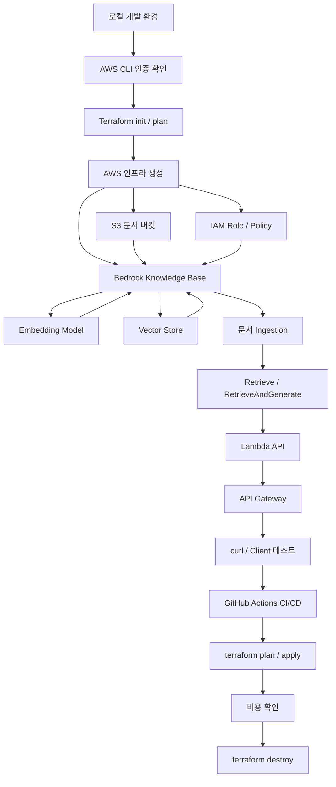

# bedrock-rag-lab

AWS Bedrock 기반의 최소 RAG 서비스를 직접 구성해보는 실습 프로젝트입니다.

## 실습 목표

- Terraform으로 AWS 인프라 구성
- S3에 문서 업로드
- Bedrock Knowledge Base + Vector Store 구성
- RAG 질의 API 호출
- IAM 최소 권한 구조 확인
- GitHub Actions로 Terraform CI/CD 연결
- 실습 종료 후 `terraform destroy`로 리소스 정리

## 전체 흐름

## 진행 순서

1. AWS CLI 인증 확인
2. Terraform 기본 설정
3. S3 및 IAM 구성
4. Bedrock Knowledge Base와 Vector Store 구성
5. 샘플 문서 업로드 및 Ingestion
6. RAG 질의 테스트
7. Lambda + API Gateway 연결
8. GitHub Actions CI/CD 구성
9. 비용 확인
10. `terraform destroy`

## 기본 환경

- AWS Region: `ap-northeast-2`
- IaC: Terraform
- CI/CD: GitHub Actions
- RAG: Amazon Bedrock Knowledge Bases
