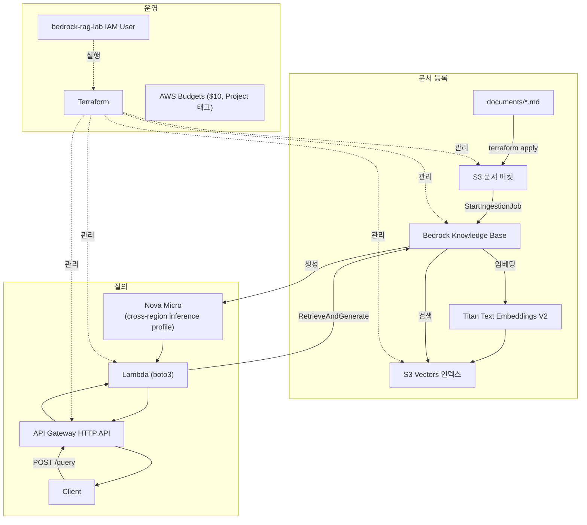

# bedrock-rag-lab

AWS Bedrock 기반의 최소 RAG 서비스를 직접 구성해본 실습 프로젝트다. Terraform으로 인프라를 선언하고, 실행 주체의 IAM 권한을 단계별로 확장하며, CLI에서 HTTP API까지 RAG 파이프라인을 검증했다.

## 구현한 것

- Terraform으로 S3 / IAM / S3 Vectors / Bedrock Knowledge Base / Lambda / API Gateway 구성
- 문서 임베딩(Titan Text Embeddings V2) → S3 Vectors 저장 → RetrieveAndGenerate(Amazon Nova Micro)로 질의응답
- Lambda + API Gateway HTTP API로 CLI 전용이던 RAG를 `POST /query`로 노출
- 실행 주체(`bedrock-rag-lab` IAM User)의 권한을 필요해질 때마다 단계적으로 확장
- AWS Budgets로 이 프로젝트 태그 기준 월 $10 상한 + 알림 설정
- `terraform destroy`로 리소스 정리까지 확인

## 아키텍처



## 진행 단계

| 단계 | 내용 |
| --- | --- |
| [00-aws-setup](docs/00-aws-setup/README.md) | AWS CLI 인증, 실습용 IAM User 구성 |
| [10-terraform-basic](docs/10-terraform-basic/README.md) | Terraform 기본 흐름 (S3 Bucket 생성/삭제) |
| [20-bedrock-rag-infra](docs/20-bedrock-rag-infra/README.md) | S3 문서 버킷, IAM Service Role, S3 Vectors, Knowledge Base |
| [30-ingestion-retrieval](docs/30-ingestion-retrieval/README.md) | Ingestion, Retrieve, RetrieveAndGenerate 검증 |
| [40-api](docs/40-api/README.md) | Lambda + API Gateway로 HTTP API 노출 |
| [50-cost-cleanup](docs/50-cost-cleanup/README.md) | 비용 분석, AWS Budgets, `terraform destroy` |

## 폴더 구조

```text
bedrock-rag-lab/
├── documents/   # Knowledge Base에 넣는 샘플 문서
├── lambda/      # Lambda 함수 소스 (boto3)
├── iam/         # 실행 주체(bedrock-rag-lab User) 권한 — Terraform 밖에서 관리
├── infra/       # Terraform 코드
└── docs/        # 단계별 실습 기록 (위 표)
```

## Quick Start

1. [00-aws-setup](docs/00-aws-setup/README.md)부터 순서대로 진행 (AWS CLI 인증 → IAM User → Terraform)
2. `infra/terraform.tfvars.example`을 복사해 `infra/terraform.tfvars`에 본인 이메일(예산 알림용) 입력
3. `cd infra && terraform init && terraform apply`
4. 각 단계 문서의 curl/CLI 명령으로 동작 확인
5. 끝나면 `terraform destroy`

## 기본 환경

- AWS Region: `ap-northeast-2`
- IaC: Terraform (`hashicorp/aws ~> 6.0`)
- Embedding: Titan Text Embeddings V2
- 생성 모델: Amazon Nova Micro — Anthropic 모델은 이 계정에서 AWS Marketplace 구독 절차가 필요해 회피했다 ([40-api](docs/40-api/README.md) 부록 참고)
- 실제 사용 비용은 거의 $0, AWS Budgets로 $10 상한 알림만 설정 ([50-cost-cleanup](docs/50-cost-cleanup/README.md))
