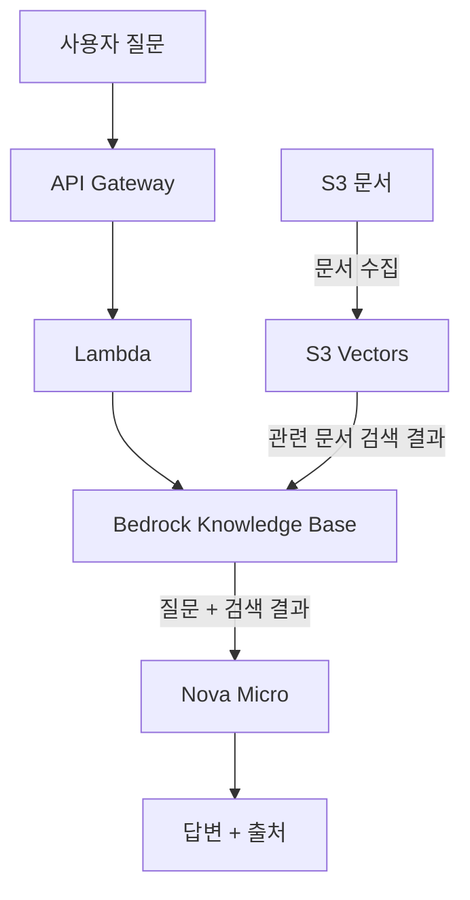

# bedrock-rag-lab

AWS Bedrock으로 간단한 RAG 서비스를 만들어보는 실습 프로젝트

- Terraform으로 AWS 인프라 생성
- S3에 RAG용 문서 저장
- Bedrock Knowledge Base로 문서 검색
- Titan Text Embeddings V2로 문서 임베딩
- Amazon Nova Micro로 답변 생성
- Lambda + API Gateway로 HTTP API 제공
- AWS Budgets로 비용 확인
- 실습 종료 후 `terraform destroy`로 리소스 삭제

## 아키텍처



- 사용자 질문은 API Gateway와 Lambda를 거쳐 Knowledge Base로 전달
- S3 문서는 문서 수집 과정을 거쳐 S3 Vectors에 저장
- Knowledge Base는 S3 Vectors의 관련 문서 검색 결과를 사용
- Nova Micro가 질문과 검색 결과를 바탕으로 답변 생성
- 전체 AWS 인프라는 Terraform으로 관리

## 진행 단계

| 단계 | 할 일 |
| --- | --- |
| [00-aws-setup](docs/00-aws-setup/README.md) | AWS CLI 로그인, 실습용 IAM User 설정 |
| [10-terraform-basic](docs/10-terraform-basic/README.md) | Terraform으로 S3 Bucket 생성/삭제 |
| [20-bedrock-rag-infra](docs/20-bedrock-rag-infra/README.md) | S3, IAM Role, S3 Vectors, Knowledge Base 구성 |
| [30-ingestion-retrieval](docs/30-ingestion-retrieval/README.md) | 문서 수집, 검색, 답변 생성 확인 |
| [40-api](docs/40-api/README.md) | Lambda + API Gateway로 HTTP API 구성 |
| [50-cost-cleanup](docs/50-cost-cleanup/README.md) | 비용 확인, Budget 설정, 리소스 삭제 |

## 비용

2026-08-24 기준 AWS 공식 가격을 참고한 주요 과금 항목이다.

| 서비스 | 이 프로젝트에서 과금되는 부분 | 참고 가격 |
| --- | --- | --- |
| Titan Text Embeddings V2 | 문서를 벡터로 변환할 때 입력 토큰 | 약 $0.02 / 100만 토큰 |
| Amazon Nova Micro | RAG 답변 생성 시 입력/출력 토큰 | 입력 약 $0.035 / 100만 토큰, 출력 약 $0.14 / 100만 토큰 |
| S3 Vectors | 벡터 저장, 업로드, 검색 요청 | 저장 예시 $0.06 / GB·월, PUT 예시 $0.20 / GB, 검색은 요청량과 처리 데이터에 따라 과금 |
| Amazon S3 | 원본 문서 저장 및 요청 | 저장량과 요청량에 따라 과금 |
| AWS Lambda | API 요청 처리 | 요청 수와 실행 시간에 따라 과금 |
| API Gateway HTTP API | `POST /query` 요청 | 요청 수와 데이터 전송량에 따라 과금 |
| AWS Budgets | 비용 알림 | 기본 Budget 모니터링은 별도 애플리케이션 실행 비용과 무관 |

- 이 프로젝트처럼 문서가 몇 개뿐이고 호출 횟수가 적은 실습에서는 모델 호출과 벡터 검색 비용도 매우 작다.
- 실제 청구 금액은 리전, 사용량, Free Tier 적용 여부, AWS 가격 변경에 따라 달라질 수 있다.
- 상세한 비용 확인과 Budget 설정은 [50-cost-cleanup](docs/50-cost-cleanup/README.md)에서 진행한다.

## 폴더 구조

```text
bedrock-rag-lab/
├── documents/   # RAG에서 사용할 샘플 문서
├── lambda/      # Lambda 함수
├── iam/         # 실습용 IAM User 권한
├── infra/       # Terraform 코드
└── docs/        # 단계별 실습 문서
```

## Quick Start

1. [00-aws-setup](docs/00-aws-setup/README.md)부터 순서대로 진행
2. `infra/terraform.tfvars.example`을 `infra/terraform.tfvars`로 복사하고 예산 알림 이메일 입력
3. `cd infra && terraform init && terraform apply`
4. 각 단계의 CLI 또는 HTTP 요청으로 동작 확인
5. 실습이 끝나면 `terraform destroy`

## 사용 기술

- AWS Region: `ap-northeast-2` (Seoul)
- IaC: Terraform
- 문서 저장: Amazon S3
- Vector Store: S3 Vectors
- RAG: Amazon Bedrock Knowledge Bases
- Embedding: Titan Text Embeddings V2
- 생성 모델: Amazon Nova Micro (APAC cross-region inference)
- API: AWS Lambda + API Gateway HTTP API
- 비용 관리: AWS Budgets

## 추가해볼 내용

현재 실습 이후에는 다음 내용을 추가해볼 수 있다.

- CI/CD: GitHub Actions로 Terraform 배포 자동화
- 멀티 모델: 여러 Bedrock 모델을 선택해서 호출하고 결과 비교
