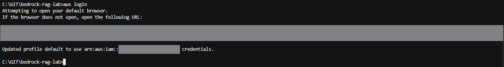
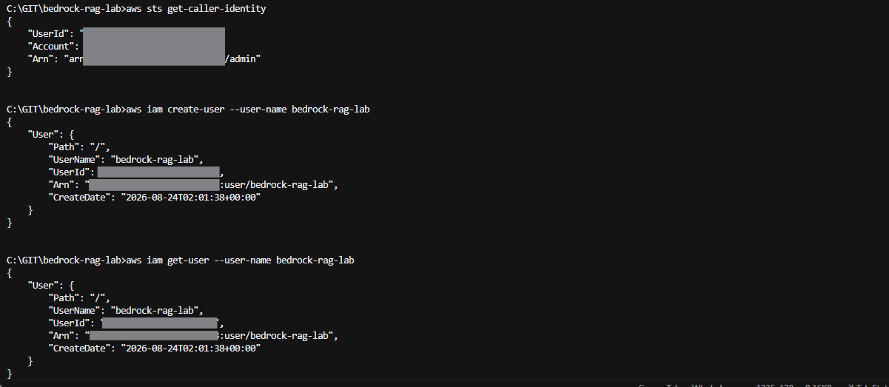
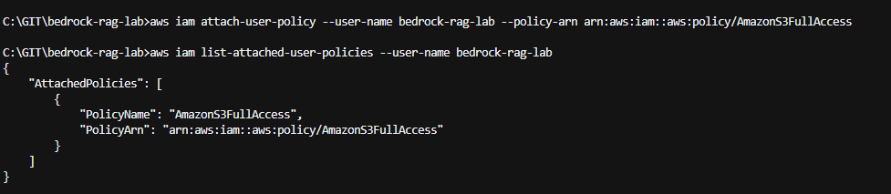
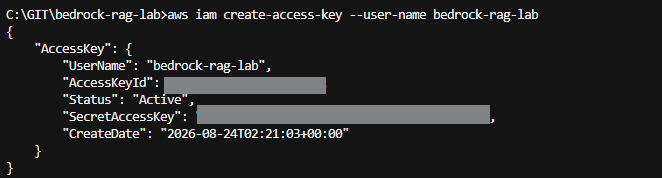
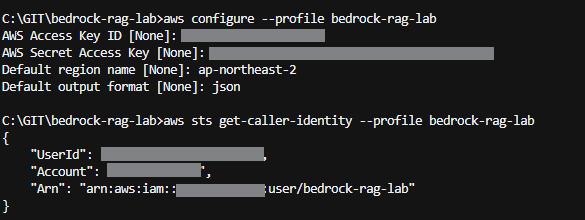

# 00. AWS 설정

Bedrock RAG 실습에서 사용할 AWS CLI와 IAM User를 설정한다.

## 이번 단계에서 할 일

- AWS CLI 로그인
- 실습용 IAM User 생성
- S3 권한 부여
- Access Key 생성
- AWS CLI Profile 설정
- 실습용 IAM User로 인증되는지 확인

## 전체 흐름

```text
Admin으로 AWS CLI 로그인
        ↓
실습용 IAM User 생성
        ↓
S3 권한 부여
        ↓
Access Key 생성
        ↓
AWS CLI Profile 설정
        ↓
인증 확인
```

## 1. AWS CLI 로그인

먼저 IAM User를 생성할 수 있는 Admin 권한으로 로그인한다.

```bash
aws login
```

로그인 후 현재 사용자를 확인한다.

```bash
aws sts get-caller-identity
```

ARN이 현재 Admin IAM User를 가리키는지 확인한다.

```text
arn:aws:iam::<ACCOUNT_ID>:user/admin
```



## 2. 실습용 IAM User 생성

Terraform 실습에 사용할 `bedrock-rag-lab` IAM User를 생성한다.

```bash
aws iam create-user --user-name bedrock-rag-lab
```

생성 여부를 확인한다.

```bash
aws iam get-user --user-name bedrock-rag-lab
```



## 3. S3 권한 부여

다음 단계에서 Terraform으로 S3 Bucket을 생성하므로 먼저 S3 권한을 부여한다.

```bash
aws iam attach-user-policy \
  --user-name bedrock-rag-lab \
  --policy-arn arn:aws:iam::aws:policy/AmazonS3FullAccess
```

연결된 정책을 확인한다.

```bash
aws iam list-attached-user-policies --user-name bedrock-rag-lab
```



## 4. Access Key 생성

AWS CLI에서 `bedrock-rag-lab` IAM User를 사용하기 위한 Access Key를 생성한다.

```bash
aws iam create-access-key --user-name bedrock-rag-lab
```

출력된 `AccessKeyId`와 `SecretAccessKey`를 다음 단계에서 사용한다.



## 5. AWS CLI Profile 설정

Admin 설정과 분리하기 위해 실습용 Profile을 만든다.

```bash
aws configure --profile bedrock-rag-lab
```

다음과 같이 입력한다.

```text
AWS Access Key ID: ********
AWS Secret Access Key: ********
Default region name: ap-northeast-2
Default output format: json
```

- Region은 서울 리전인 `ap-northeast-2`를 사용한다.
- Profile 이름은 `bedrock-rag-lab`으로 통일한다.

## 6. 인증 확인

새로 만든 Profile로 현재 사용자를 확인한다.

```bash
aws sts get-caller-identity --profile bedrock-rag-lab
```

ARN이 다음과 같이 나오면 설정이 완료된 것이다.

```text
arn:aws:iam::<ACCOUNT_ID>:user/bedrock-rag-lab
```



## 7. 터미널에서 Profile 사용

이후 Terraform 명령이 `bedrock-rag-lab` Profile을 사용하도록 환경 변수를 설정한다.

macOS/Linux:

```bash
export AWS_PROFILE=bedrock-rag-lab
```

Windows CMD:

```cmd
set AWS_PROFILE=bedrock-rag-lab
```

Windows PowerShell:

```powershell
$env:AWS_PROFILE="bedrock-rag-lab"
```

설정 후 다시 확인한다.

```bash
aws sts get-caller-identity
```

.png)

## 완료 확인

- `bedrock-rag-lab` IAM User가 생성됨
- `AmazonS3FullAccess` 정책이 연결됨
- `bedrock-rag-lab` AWS CLI Profile이 설정됨
- `aws sts get-caller-identity`에서 `bedrock-rag-lab` User가 확인됨

## 다음 단계

[10. Terraform 기본 실습](../10-terraform-basic/README.md)에서 S3 Bucket을 직접 생성하고 삭제한다.

---

## 참고

### Access Key 관리

- `AccessKeyId`와 `SecretAccessKey`는 GitHub에 커밋하지 않는다.
- Access Key가 보이는 터미널 화면을 그대로 공개하지 않는다.
- Terraform 코드에 Access Key를 직접 작성하지 않는다.
- 실습이 끝나면 사용하지 않는 Access Key를 삭제한다.

### IAM User와 IAM Role

- IAM User: 사람이나 프로그램이 AWS에 로그인할 때 사용할 수 있는 사용자 계정
- IAM Role: AWS 서비스 등이 필요한 권한을 임시로 사용할 수 있게 하는 역할
- 이 단계에서는 사람이 CLI와 Terraform을 실행하므로 `bedrock-rag-lab` IAM User를 사용한다.
- 이후 Bedrock과 Lambda에는 각각 필요한 IAM Role을 만든다.

### 스크린샷 공개 시 확인할 값

- Access Key와 Secret Access Key는 반드시 가린다.
- AWS Account ID는 인증 정보는 아니지만 실습 자료에서는 가려서 사용한다.

### `AccessDenied`가 발생하는 경우

명령을 실행할 권한이 현재 사용자에게 없는 경우 `AccessDenied`가 발생한다.

먼저 어떤 사용자로 인증되어 있는지 확인한다.

```bash
aws sts get-caller-identity
```

Admin 작업 중이라면 Admin IAM User인지, 실습 작업 중이라면 `bedrock-rag-lab` IAM User인지 확인한다.
