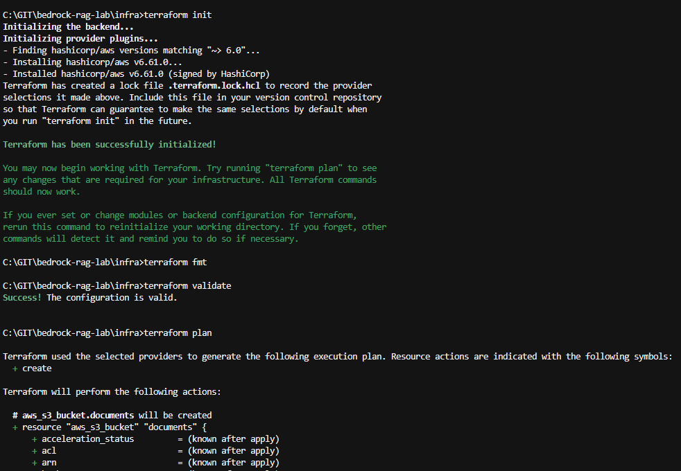
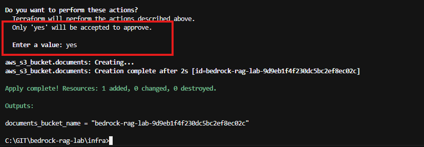
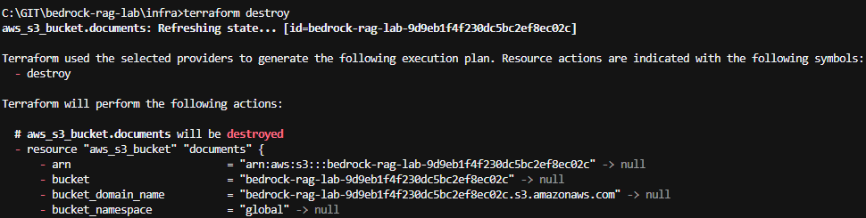
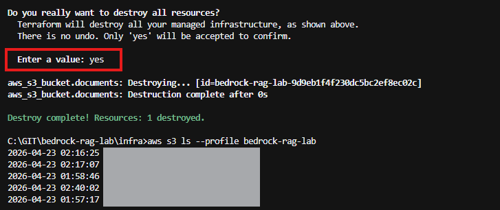

# 10. Terraform 기본 실습

Terraform으로 S3 Bucket을 만들고 삭제하며 기본 사용 흐름을 확인한다.

## 이번 단계에서 할 일

- Terraform 설치 확인
- AWS Provider 설정
- S3 Bucket 정의
- `terraform plan`으로 변경 내용 확인
- `terraform apply`로 Bucket 생성
- `terraform destroy`로 Bucket 삭제

## 전체 흐름

```text
Terraform 설정
    ↓
S3 Bucket 정의
    ↓
terraform init
    ↓
terraform plan
    ↓
terraform apply
    ↓
생성 확인
    ↓
terraform destroy
```

## 1. Terraform 설치 확인

```bash
terraform -version
```

버전 정보가 출력되면 준비가 완료된 것이다.

## 2. AWS Provider 설정

`providers.tf`에서 Terraform이 사용할 AWS Region과 Profile을 지정한다.

```hcl
provider "aws" {
  region  = var.aws_region
  profile = var.aws_profile
}
```

```hcl
variable "aws_region" {
  type    = string
  default = "ap-northeast-2"
}

variable "aws_profile" {
  type    = string
  default = "bedrock-rag-lab"
}
```

현재 Profile도 확인한다.

```bash
aws sts get-caller-identity --profile bedrock-rag-lab
```

## 3. S3 Bucket 정의

`s3.tf`에 테스트용 Bucket을 정의한다.

```hcl
resource "aws_s3_bucket" "documents" {
  bucket_prefix = "bedrock-rag-lab-"

  tags = {
    Project     = "bedrock-rag-lab"
    Environment = "lab"
  }
}
```

S3 Bucket 이름은 전 세계에서 중복될 수 없으므로 `bucket_prefix`를 사용해 고유한 이름을 자동 생성한다.

## 4. Terraform 실행

```bash
cd infra
terraform init
terraform fmt
terraform validate
terraform plan
```

- `init`: 필요한 Provider를 준비
- `fmt`: Terraform 코드 형식 정리
- `validate`: 설정 문법 확인
- `plan`: 생성되거나 변경될 리소스 확인



`plan`에 문제가 없다면 실제 리소스를 생성한다.

```bash
terraform apply
```

확인 메시지가 나오면 변경 내용을 확인하고 `yes`를 입력한다.



## 5. 생성 확인

```bash
aws s3 ls --profile bedrock-rag-lab
```

Terraform이 만든 `bedrock-rag-lab-...` Bucket이 보이면 성공이다.

## 6. 리소스 삭제

이번 단계는 Terraform의 생성과 삭제 흐름을 확인하는 실습이므로 Bucket을 다시 삭제한다.

```bash
terraform destroy
```



삭제 후 다시 확인한다.

```bash
aws s3 ls --profile bedrock-rag-lab
```

생성했던 Bucket이 더 이상 보이지 않으면 완료된 것이다.



## 완료 확인

- Terraform Provider가 정상적으로 초기화됨
- `terraform plan`으로 변경 내용을 확인함
- S3 Bucket 생성 확인
- `terraform destroy`로 S3 Bucket 삭제 확인

## 다음 단계

[20. Bedrock RAG 인프라](../20-bedrock-rag-infra/README.md)에서 실제 RAG 서비스에 필요한 AWS 리소스를 구성한다.

---

## 참고

### Terraform state 파일

Terraform은 생성한 리소스의 상태를 `terraform.tfstate`에 저장한다.

- `terraform.tfstate`, `*.tfstate.*`는 Git에 커밋하지 않는다.
- `.terraform/`도 Git에 커밋하지 않는다.
- 이 프로젝트에서는 `.gitignore`로 제외한다.

### `terraform plan`과 `apply`

- `plan`은 앞으로 적용될 변경 내용을 미리 보여준다.
- `apply`는 그 변경을 AWS에 실제로 적용한다.
- 예상하지 않은 삭제나 교체가 보이면 `apply`하기 전에 Terraform 코드를 확인한다.
