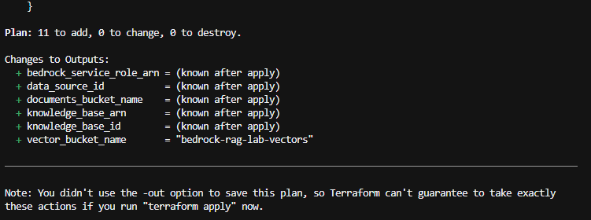
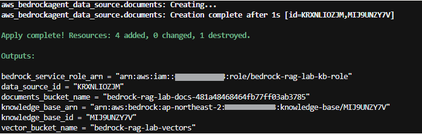
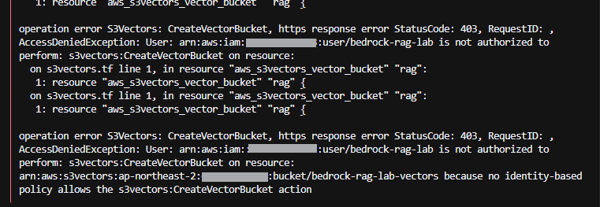

# 20. Bedrock RAG 인프라

Terraform으로 Bedrock Knowledge Base에 필요한 AWS 리소스를 구성한다.

## 이번 단계에서 할 일

- RAG 문서를 저장할 S3 Bucket 생성
- Bedrock이 사용할 IAM Role 생성
- S3 Vectors 생성
- Bedrock Knowledge Base 생성
- S3 Data Source 연결
- 샘플 문서 업로드

## 전체 흐름

```text
S3 문서
   ↓
Bedrock Knowledge Base
   ↓
Titan Text Embeddings V2
   ↓
S3 Vectors
```

## Knowledge Base란?

Bedrock Knowledge Base는 **RAG에 필요한 문서 처리와 검색 과정을 연결해주는 AWS 기능**이다.

직접 RAG를 만든다면 다음 과정을 각각 구현해야 한다.

```text
원본 문서 읽기
    ↓
문서를 작은 단위로 나누기 (Chunking)
    ↓
각 문서를 숫자 벡터로 변환 (Embedding)
    ↓
벡터 저장소에 저장
    ↓
사용자 질문과 비슷한 문서 검색
    ↓
검색 결과를 LLM에 전달
```

Knowledge Base를 사용하면 이 과정을 Bedrock에서 관리할 수 있다.

이번 프로젝트에서는 다음 AWS 리소스를 연결한다.

| 구성 요소 | 역할 |
| --- | --- |
| S3 | 원본 문서 저장 |
| Data Source | Knowledge Base가 읽을 문서 위치 지정 |
| Titan Text Embeddings V2 | 문서와 질문을 숫자 벡터로 변환 |
| S3 Vectors | 변환된 벡터 저장 및 검색 |
| Knowledge Base | 문서 수집과 검색 과정 연결 |
| Nova Micro | 검색된 내용을 바탕으로 최종 답변 생성 |

Knowledge Base를 만든 것만으로 문서 검색이 바로 가능한 것은 아니다. 다음 단계에서 **문서 수집(Ingestion)**을 실행해야 한다.

```text
S3 원본 문서
    ↓ 문서 수집
문서를 Chunk로 분리
    ↓
Titan Text Embeddings V2
    ↓
숫자 벡터 생성
    ↓
S3 Vectors 저장
```

문서 수집이 끝난 뒤 사용자가 질문하면 반대 방향으로 검색이 진행된다.

```text
사용자 질문
    ↓
질문을 숫자 벡터로 변환
    ↓
S3 Vectors에서 비슷한 문서 검색
    ↓
관련 문서 반환
    ↓
Nova Micro에 질문 + 관련 문서 전달
    ↓
최종 답변 생성
```

Bedrock에서는 이 과정을 두 가지 방식으로 사용할 수 있다.

- `Retrieve`: 관련 문서만 검색
- `RetrieveAndGenerate`: 관련 문서를 검색하고 LLM으로 답변까지 생성

`30. 문서 수집과 RAG 검색`에서 두 방식을 모두 직접 확인한다.

## 1. 문서 저장용 S3 Bucket

`s3.tf`에서 RAG에 사용할 문서 Bucket을 만든다.

```hcl
resource "aws_s3_bucket" "documents" {
  bucket_prefix = "bedrock-rag-lab-docs-"
  ...
}

resource "aws_s3_bucket_public_access_block" "documents" {
  bucket = aws_s3_bucket.documents.id
  ...
}
```

`documents/`의 샘플 문서도 Terraform으로 함께 업로드한다.

```text
documents/
├── project-overview.md
├── architecture.md
└── api.md
```

## 2. Bedrock IAM Role

Bedrock이 S3, 임베딩 모델, S3 Vectors를 사용할 수 있도록 IAM Role을 만든다.

```text
Bedrock Knowledge Base
        ↓ IAM Role
   ├─ S3 문서 읽기
   ├─ Titan Embeddings 호출
   └─ S3 Vectors 사용
```

`iam.tf`에서 Role과 필요한 권한을 정의한다.

이 Role은 [00. AWS 설정](../00-aws-setup/README.md)에서 만든 `bedrock-rag-lab` IAM User와는 별개다.

- `bedrock-rag-lab` IAM User: 사람이 Terraform과 AWS CLI를 실행
- Bedrock IAM Role: Bedrock 서비스가 AWS 리소스에 접근할 때 사용

## 3. 임베딩 모델 설정

문서를 검색 가능한 숫자 벡터로 변환하기 위해 Titan Text Embeddings V2를 사용한다.

```text
Model ID: amazon.titan-embed-text-v2:0
```

## 4. S3 Vectors 생성

`s3vectors.tf`에서 벡터를 저장할 Bucket과 Index를 만든다.

```hcl
resource "aws_s3vectors_vector_bucket" "rag" { ... }

resource "aws_s3vectors_index" "rag" {
  data_type       = "float32"
  dimension       = var.vector_dimension
  distance_metric = var.vector_distance_metric
}
```

이번 실습에서는 Titan Text Embeddings V2의 설정에 맞춰 1024차원 벡터와 cosine 거리 방식을 사용한다.

## 5. Knowledge Base 생성

`bedrock.tf`에서 Knowledge Base를 생성하고 임베딩 모델과 S3 Vectors를 연결한다.

```hcl
resource "aws_bedrockagent_knowledge_base" "rag" {
  role_arn = aws_iam_role.bedrock_kb.arn

  knowledge_base_configuration {
    type = "VECTOR"
    vector_knowledge_base_configuration {
      embedding_model_arn = local.embedding_model_arn
    }
  }

  storage_configuration {
    type = "S3_VECTORS"
    s3_vectors_configuration {
      index_arn = aws_s3vectors_index.rag.index_arn
    }
  }
}
```

## 6. S3 Data Source 연결

Knowledge Base가 어느 S3 Bucket에서 문서를 읽을지 연결한다.

```hcl
resource "aws_bedrockagent_data_source" "documents" {
  knowledge_base_id = aws_bedrockagent_knowledge_base.rag.id

  data_source_configuration {
    type = "S3"
    s3_configuration {
      bucket_arn = aws_s3_bucket.documents.arn
    }
  }
}
```

## 7. Terraform 실행

이 단계부터는 S3 외에도 IAM, Bedrock, S3 Vectors를 생성하므로 `bedrock-rag-lab` IAM User에 프로젝트용 추가 권한이 필요하다.

프로젝트에서 사용하는 권한은 [`iam/bedrock-rag-lab-provisioning.json`](../../iam/bedrock-rag-lab-provisioning.json)에 정의되어 있다. 적용 방법은 [`iam/README.md`](../../iam/README.md)를 따른다.

권한 적용 후 Terraform을 실행한다.

```bash
cd infra
terraform fmt
terraform validate
terraform plan
terraform apply
```



완료되면 Knowledge Base ID와 S3 Bucket 등의 Output이 표시된다.



## 8. 생성 확인

Terraform Output을 확인한다.

```bash
terraform output
```

주요 Output:

```text
documents_bucket_name
vector_bucket_name
bedrock_service_role_arn
knowledge_base_id
knowledge_base_arn
data_source_id
```

Knowledge Base도 AWS CLI로 확인할 수 있다.

```bash
aws bedrock-agent get-knowledge-base \
  --knowledge-base-id <KNOWLEDGE_BASE_ID> \
  --profile bedrock-rag-lab
```

## 완료 확인

- S3 문서 Bucket과 샘플 문서 생성
- Bedrock IAM Role 생성
- S3 Vectors Bucket과 Index 생성
- Knowledge Base 생성
- S3 Data Source 연결

## 다음 단계

[30. 문서 수집과 RAG 검색](../30-ingestion-retrieval/README.md)에서 S3 문서를 Knowledge Base에 수집하고 실제 질문을 테스트한다.

---

## 참고

### `AccessDenied`가 발생하는 경우

이 단계에서는 Terraform이 IAM Role, S3 Vectors, Knowledge Base 등 여러 리소스를 생성한다. `bedrock-rag-lab` IAM User에 필요한 권한이 없으면 `AccessDenied`가 발생한다.



먼저 현재 사용자를 확인한다.

```bash
aws sts get-caller-identity
```

그 다음 [`iam/bedrock-rag-lab-provisioning.json`](../../iam/bedrock-rag-lab-provisioning.json)의 정책이 적용되어 있는지 확인한다.

실습 과정에서는 IAM Role, S3 Vectors, Knowledge Base를 생성하는 권한이 추가로 필요했다.

### Bedrock IAM Role의 권한

Bedrock IAM Role에는 다음 작업에 필요한 권한만 부여한다.

- S3 문서 읽기
- Titan Text Embeddings V2 호출
- S3 Vectors 읽기/쓰기

Trust Policy에서는 `bedrock.amazonaws.com`이 이 Role을 사용할 수 있도록 설정한다.

### Terraform state

`terraform.tfstate`에는 생성한 AWS 리소스의 ID와 ARN 등이 저장된다. Git에 커밋하지 않는다.
