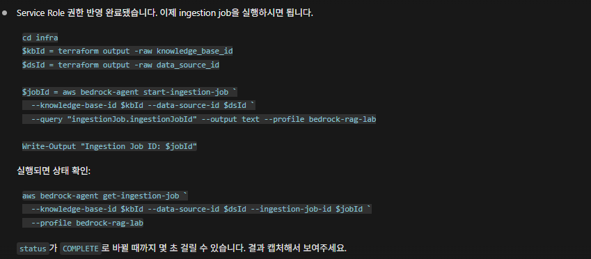
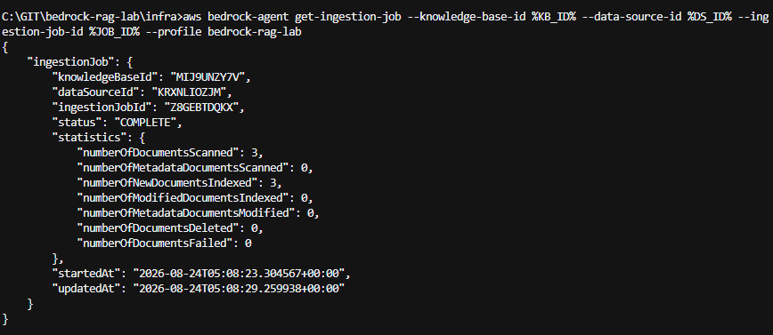

# 30. 문서 수집과 RAG 검색

S3에 저장된 문서를 Knowledge Base에 수집하고, AWS CLI로 검색과 답변 생성을 확인한다.

## 이번 단계에서 할 일

- Knowledge Base에 S3 문서 수집
- 문서 수집 완료 상태 확인
- `Retrieve`로 관련 문서 검색
- `RetrieveAndGenerate`로 답변 생성
- 답변의 출처 확인

## 전체 흐름

```text
S3 문서
   ↓
문서 수집
   ↓
임베딩 생성
   ↓
S3 Vectors 저장
   ↓
관련 문서 검색
   ↓
질문 + 검색 결과
   ↓
Nova Micro
   ↓
답변 + 출처
```

## 1. 문서 확인

샘플 문서는 20단계의 `terraform apply`에서 S3에 업로드되었다.

```powershell
cd infra
$bucket = terraform output -raw documents_bucket_name
aws s3 ls s3://$bucket --profile bedrock-rag-lab
```

3개의 Markdown 문서가 보이는지 확인한다.

## 2. 문서 수집 시작

Knowledge Base ID와 Data Source ID를 Terraform Output에서 가져온다.

```powershell
$kbId = terraform output -raw knowledge_base_id
$dsId = terraform output -raw data_source_id
```

문서 수집 작업을 시작한다.

```powershell
$jobId = aws bedrock-agent start-ingestion-job `
  --knowledge-base-id $kbId `
  --data-source-id $dsId `
  --query "ingestionJob.ingestionJobId" `
  --output text `
  --profile bedrock-rag-lab
```



## 3. 문서 수집 완료 확인

```powershell
aws bedrock-agent get-ingestion-job `
  --knowledge-base-id $kbId `
  --data-source-id $dsId `
  --ingestion-job-id $jobId `
  --profile bedrock-rag-lab
```

`status`가 `COMPLETE`가 되면 문서 수집이 끝난 것이다.

샘플 문서 3개를 사용하므로 `numberOfNewDocumentsIndexed`에서도 3개의 문서가 처리되었는지 확인할 수 있다.



## 4. 관련 문서 검색

먼저 답변을 생성하지 않고 Knowledge Base가 관련 문서를 제대로 찾는지만 확인한다.

```powershell
aws bedrock-agent-runtime retrieve `
  --knowledge-base-id $kbId `
  --retrieval-query text="이 프로젝트의 인증 방식은?" `
  --profile bedrock-rag-lab
```

결과에 `project-overview.md`의 JWT 관련 내용이 나오면 검색이 정상적으로 동작한 것이다.

실제 결과는 [retrieve-result.json](retrieve-result.json)에서 확인할 수 있다.

## 5. 답변 생성

검색된 문서를 바탕으로 실제 답변을 생성한다.

이 프로젝트에서는 Amazon Nova Micro를 생성 모델로 사용한다.

```powershell
$modelArn = "arn:aws:bedrock:ap-northeast-2:<ACCOUNT_ID>:inference-profile/apac.amazon.nova-micro-v1:0"

$config = @{
  type = "KNOWLEDGE_BASE"
  knowledgeBaseConfiguration = @{
    knowledgeBaseId = $kbId
    modelArn        = $modelArn
  }
} | ConvertTo-Json -Depth 5

$tempFile = [System.IO.Path]::GetTempFileName()
Set-Content -Path $tempFile -Value $config -Encoding ascii

aws bedrock-agent-runtime retrieve-and-generate `
  --input text="이 프로젝트의 인증 방식은?" `
  --retrieve-and-generate-configuration file://$tempFile `
  --profile bedrock-rag-lab

Remove-Item $tempFile
```

다음을 확인한다.

- `output.text`에 JWT 기반 인증이라는 답변이 포함됨
- `citations`에 답변의 근거 문서가 포함됨

## 완료 확인

- 문서 수집 작업이 `COMPLETE` 상태가 됨
- `Retrieve`에서 질문과 관련된 문서를 찾음
- `RetrieveAndGenerate`에서 답변이 생성됨
- 답변과 함께 출처가 반환됨

## 다음 단계

[40. HTTP API](../40-api/README.md)에서 CLI로 확인한 RAG 기능을 Lambda와 API Gateway를 통해 호출한다.

---

## 참고

### `Retrieve`와 `RetrieveAndGenerate`

- `Retrieve`: 질문과 관련된 문서를 검색
- `RetrieveAndGenerate`: 관련 문서를 검색한 뒤 생성 모델을 이용해 최종 답변까지 생성

검색 결과부터 확인한 뒤 답변 생성을 테스트하면 문제가 검색 단계인지 생성 단계인지 구분하기 쉽다.

### 저장된 결과 파일의 모델

[retrieve-and-generate-result.json](retrieve-and-generate-result.json)은 30단계를 처음 검증했을 때 사용했던 Claude 3 Haiku의 실제 응답이다.

당시에는 다음 질문에 비교적 짧게 답했다.

```text
이 프로젝트의 인증 방식은?
```

```text
이 프로젝트는 JWT 기반 인증을 사용한다.
```

이후 40단계에서 생성 모델을 Nova Micro로 변경했다. 같은 RAG 구조라도 생성 모델에 따라 답변 범위나 지시 따르기 정도가 달라질 수 있다.

### APAC Cross-Region Inference Profile

최종 실습에서는 Nova Micro를 다음 inference profile로 호출한다.

```text
apac.amazon.nova-micro-v1:0
```

Cross-Region Inference Profile은 모델 요청을 APAC의 여러 AWS 리전 중 처리 가능한 리전으로 전달할 수 있게 해주는 Bedrock 기능이다.

```text
서울 리전의 Lambda / Knowledge Base
            ↓
APAC Inference Profile
            ↓
APAC 내 지원 리전에서 Nova Micro 추론
```

- Lambda와 Knowledge Base 자체가 다른 리전으로 이동하는 것은 아니다.
- 모델 추론 요청만 다른 APAC 리전에서 처리될 수 있다.
- 이 때문에 `bedrock:GetInferenceProfile`, `bedrock:InvokeModel` 같은 권한이 필요하다.

### Windows에서 한글이 깨지는 경우

PowerShell이나 CMD의 인코딩 설정에 따라 AWS CLI 출력의 한글이 깨질 수 있다.

PowerShell에서는 다음 환경 변수를 설정한 뒤 다시 실행할 수 있다.

```powershell
$env:PYTHONUTF8="1"
$env:PYTHONIOENCODING="utf-8"
```

### `AccessDenied`가 발생하는 경우

문서 수집이나 검색 명령에서 `AccessDenied`가 발생하면 `bedrock-rag-lab` IAM User에 다음 작업 권한이 있는지 확인한다.

- `bedrock:StartIngestionJob`
- `bedrock:GetIngestionJob`
- `bedrock:Retrieve`
- `bedrock:RetrieveAndGenerate`
- 모델 호출에 필요한 Bedrock 권한

프로젝트용 정책은 [`iam/bedrock-rag-lab-provisioning.json`](../../iam/bedrock-rag-lab-provisioning.json)에서 확인한다.

### 생성 모델 변경

처음에는 Claude 3 Haiku를 사용했지만 Anthropic 모델 사용 절차와 AWS Marketplace 권한이 추가로 필요해 최종 실습에서는 Amazon Nova Micro로 변경했다.
