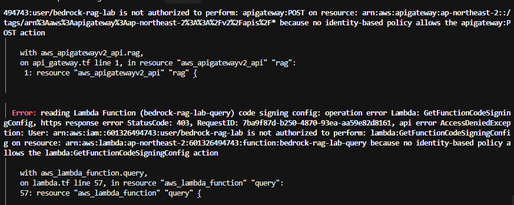
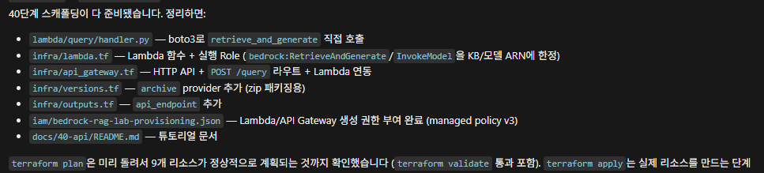
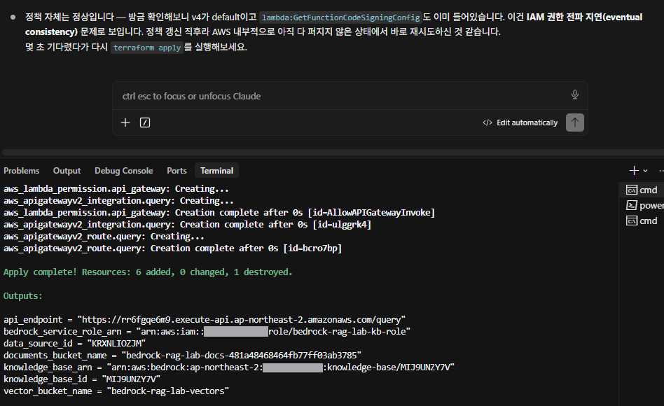
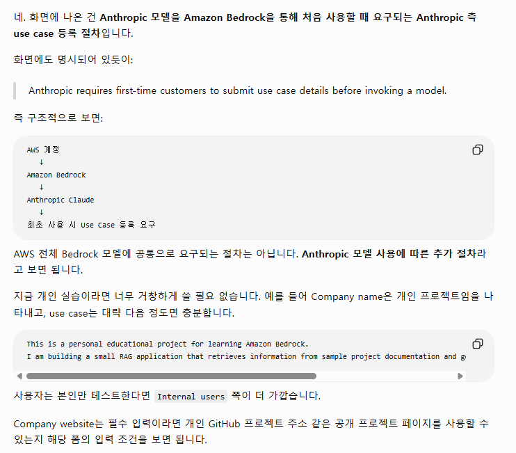
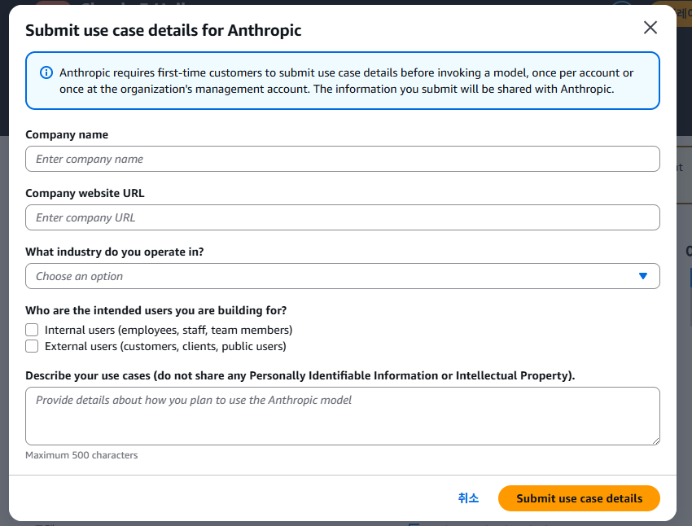

# 40. API Layer

CLI(`aws bedrock-agent-runtime retrieve-and-generate`)에서만 되던 RAG 질의를 HTTP API로 노출한다.

```text
Client
  ↓
API Gateway (HTTP API)
  ↓
Lambda (boto3)
  ↓
Bedrock Agent Runtime — RetrieveAndGenerate
  ↓
Response
```

## 완료 기준

```text
Lambda 함수 + 실행 Role 생성
        ↓
Lambda에 bedrock:RetrieveAndGenerate / InvokeModel 권한 부여
        ↓
API Gateway HTTP API + POST /query 라우트 연결
        ↓
curl로 실제 질의 테스트
```

## 폴더 구조

```text
bedrock-rag-lab/
├── lambda/
│   └── query/
│       └── handler.py
│
├── iam/
│   ├── README.md
│   └── bedrock-rag-lab-provisioning.json
│
└── infra/
    ├── lambda.tf
    ├── api_gateway.tf
    └── ...
```

## 1. Lambda 코드 (boto3 직접 호출)

30단계에서 CLI로 이미 검증한 `retrieve_and_generate` 호출을 그대로 boto3로 옮긴다. 프레임워크 없이 표준 라이브러리 + boto3만 쓴다.

```python
# lambda/query/handler.py
import json, os, boto3

client = boto3.client("bedrock-agent-runtime")
KNOWLEDGE_BASE_ID = os.environ["KNOWLEDGE_BASE_ID"]
MODEL_ARN = os.environ["MODEL_ARN"]

def handler(event, context):
    body = json.loads(event.get("body") or "{}")
    question = body.get("question")
    if not question:
        return _response(400, {"error": "question is required"})

    result = client.retrieve_and_generate(
        input={"text": question},
        retrieveAndGenerateConfiguration={
            "type": "KNOWLEDGE_BASE",
            "knowledgeBaseConfiguration": {
                "knowledgeBaseId": KNOWLEDGE_BASE_ID,
                "modelArn": MODEL_ARN,
            },
        },
    )
    return _response(200, {"answer": result["output"]["text"]})

def _response(status_code, payload):
    return {
        "statusCode": status_code,
        "headers": {"Content-Type": "application/json"},
        "body": json.dumps(payload, ensure_ascii=False),
    }
```

`ensure_ascii=False`를 빼먹으면 응답의 한글이 `\uXXXX` 이스케이프로 나온다 (30단계에서 겪은 인코딩 문제와 같은 종류라 미리 처리해뒀다).

Lambda 런타임(Python 3.13)에는 boto3가 기본 포함되어 있어 별도 패키징이 필요 없다.

## 2. Lambda 실행 Role + 함수 (`infra/lambda.tf`)

- **Trust policy**: `lambda.amazonaws.com`만 assume 가능.
- **권한**: `AWSLambdaBasicExecutionRole`(CloudWatch Logs, AWS 관리형) + `bedrock:RetrieveAndGenerate`/`bedrock:Retrieve`(이 Knowledge Base ARN 한정) + `bedrock:InvokeModel`(생성 모델 inference profile ARN + 기반 foundation model ARN 패턴) + `bedrock:GetInferenceProfile`(생성 모델이 cross-region inference profile이라 별도로 필요). `RetrieveAndGenerate`가 내부적으로 `Retrieve`도 요구한다는 건 처음엔 몰랐다 — 첫 curl 테스트가 Lambda 안에서 "not authorized to perform: bedrock:Retrieve"로 실패해서 CloudWatch Logs로 확인한 뒤 추가했다. 생성 모델을 Nova Micro(inference profile)로 바꾼 뒤에는 `GetInferenceProfile` 누락으로 또 한 번 막혔다 — 자세한 경위는 부록 참고.
- **패키징**: `data "archive_file"`로 `handler.py`를 zip으로 묶고 `source_code_hash`로 변경을 감지한다.
- **환경변수**: `KNOWLEDGE_BASE_ID`, `MODEL_ARN`을 Terraform 리소스 참조로 주입 (하드코딩 없음).

## 3. API Gateway (`infra/api_gateway.tf`)

HTTP API(REST API 대비 더 단순하고 저렴)로 구성한다.

```text
aws_apigatewayv2_api (HTTP)
  → aws_apigatewayv2_integration (AWS_PROXY, payload_format_version = "2.0")
  → aws_apigatewayv2_route ("POST /query")
  → aws_apigatewayv2_stage ("$default", auto_deploy = true)

aws_lambda_permission으로 API Gateway가 이 Lambda를 호출할 수 있도록 허용
```

`payload_format_version = "2.0"`을 명시했다 (기본값은 `1.0`인데, 2.0이 event/response 구조가 더 단순해서 Lambda 코드가 짧아진다).

## 4. 실행 주체(bedrock-rag-lab User) 권한 확장

Lambda/API Gateway를 만드는 것도 `bedrock-rag-lab` User 자신의 권한이 필요하다. 이번엔 접근을 조금 바꿨다 — 이 프로젝트는 짧게 쓰고 버릴 실습이고 CI/CD(50단계)도 하지 않기로 해서, Role마다 개별 statement를 추가하는 대신 **`role/bedrock-rag-lab-*` 명명 규칙 기준 와일드카드**로 단순화했다 (`ProjectRoleManage`).

추가된 권한 요약:

| 대상 | 목적 |
| --- | --- |
| IAM Role 관리 범위 확장 | `bedrock-rag-lab-kb-role` 하나만 → `bedrock-rag-lab-*` 전체 (Lambda Role 포함) |
| `iam:PassRole` to `lambda.amazonaws.com` | Lambda 생성 시 실행 Role을 넘겨주기 위해 |
| `lambda:*` 관리 action | 함수 ARN(`function:bedrock-rag-lab-*`)에 한정 |
| `apigateway:*` | 리전 전체(`arn:aws:apigateway:ap-northeast-2::*`) |

`apigateway:*`는 다른 statement들보다 의도적으로 넓다. 처음엔 `/apis*`로 좁혀서 시작했는데, API 생성 직후 태깅 호출(`POST /tags/...`)이 `/apis`가 아니라 `/tags`라는 별도 리소스 경로를 쓰면서 막혔다 — API Gateway v2는 `/apis`, `/tags`, `/restapis` 등 기능별로 리소스 경로가 나뉘어 있어서, 하나씩 맞추는 대신 리전 전체로 넓혔다 (`00-aws-setup`에서 정한 편의 우선 원칙과 같은 맥락). 실제 겪은 에러:



적용 방법은 [iam/README.md](../../iam/README.md) 참고 (managed policy version 갱신).

## 5. Terraform 적용

40단계 스캐폴딩이 준비된 뒤 `terraform plan`으로 먼저 확인했다:



```powershell
cd infra
terraform fmt
terraform validate
terraform plan
terraform apply
```

`plan`에서 9개 리소스(IAM Role, Role Policy, Role Policy Attachment, Lambda Function, API Gateway API/Integration/Route/Stage, Lambda Permission)가 추가되는지 확인한다.

권한 갱신 후 재시도한 apply 완료 결과 (`api_endpoint` 포함 outputs):



## 6. curl로 테스트

```powershell
cd infra
$endpoint = terraform output -raw api_endpoint

curl.exe -X POST $endpoint `
  -H "Content-Type: application/json" `
  -d '{"question": "이 프로젝트의 인증 방식은?"}'
```

실제 응답 (Nova Micro 전환 후 성공):

```json
{"answer": "이 프로젝트는 AWS Bedrock 기반 RAG(Retrieval-Augmented Generation) 서비스를 제공합니다. 인증은 JWT 기반 인증을 사용하며, 데이터베이스로는 PostgreSQL을 사용합니다. ..."}
```

전체 응답은 [curl-result.json](curl-result.json) 참고. 문서 3개(인증, 아키텍처, API) 내용을 종합한 답변이 나왔다.

Windows에서 한글이 깨지면 30단계에서 겪었던 것과 같은 콘솔 인코딩 문제일 수 있다 — `chcp 65001` 후 재시도하거나, 응답을 파일로 리다이렉트해서 에디터로 확인한다.

**좁게 물어봤을 때는 어떨까** — "다른 정보는 필요 없고 인증 방식만 한 문장으로" 요청해봤다.

```powershell
curl.exe -X POST $endpoint `
  -H "Content-Type: application/json" `
  -d '{"question": "이 프로젝트의 인증 방식만 한 문장으로 알려줘. 다른 정보는 필요 없어."}'
```

결과는 [curl-result-narrow-question.json](curl-result-narrow-question.json) — 지시를 따르지 않고 7개 항목 전체를 **영어로** 나열했다. Claude 계열에 비해 Nova Micro의 instruction-following이 약하다는 걸 보여주는 실제 사례다. 이 실습은 파이프라인 동작 확인이 목표라 프롬프트 튜닝은 범위 밖으로 남겨둔다.

## 부록: 생성 모델 전환기 (Claude 3 Haiku → Nova Micro)

30단계에서 검증했던 Claude 3 Haiku를 그대로 썼는데, 40단계에서 처음 curl 테스트를 하니 연달아 새로운 에러가 나왔다. 시간순으로 정리한다.

**1) `bedrock:Retrieve` 권한 누락** — `infra/lambda.tf`에 추가해서 해결 (2번 참고).

**2) Anthropic 모델 "Model use case details" 미제출**

```text
ValidationException: Model use case details have not been submitted for this account.
Fill out the Anthropic use case details form before using the model.
If you have already filled out the form, try again in 15 minutes.
```

같은 계정의 `bedrock-rag-lab` User로 CLI에서 raw `retrieve-and-generate`, `bedrock-runtime converse`를 직접 호출해도 동일하게 막혀서 **계정 단위로 Anthropic 모델에 걸려있는 게이트**임을 확인했다 (Lambda나 코드 문제가 아니다). 30단계에서는 같은 모델로 성공했었는데 이 시점엔 막혀 있었다 — 정확한 재현 조건은 알 수 없다. Bedrock 콘솔 → Model catalog에서 use case 양식을 다시 제출했다.




**3) AWS Marketplace 구독 권한 필요**

15분 뒤 재시도하니 다른 에러로 바뀌었다.

```text
ValidationException: Model access is denied due to IAM user or service role is not authorized to
perform the required AWS Marketplace actions (aws-marketplace:ViewSubscriptions, aws-marketplace:Subscribe)
to enable access to this model.
```

Anthropic 모델은 AWS Marketplace를 통해 제공되어서, 이 action들을 가진 주체가 한 번 호출해야 계정 전체에 활성화된다. **여기서 방향을 바꿨다** — Marketplace 구독을 계속 진행하는 대신, **AWS 자체 모델(Marketplace 게이트가 없는)로 교체**하기로 했다.

**4) Claude 3 Haiku → Amazon Nova Micro로 교체**

`ap-northeast-2`에서 Nova 계열은 in-region on-demand가 아니라 cross-region inference profile을 거쳐야 한다(30단계에서 이미 확인한 제약). 실제 API로 조회해서 정확한 profile ID와 ARN을 확인했다.

```bash
aws bedrock list-inference-profiles --region ap-northeast-2 \
  --query "inferenceProfileSummaries[?contains(inferenceProfileId, 'nova')].[inferenceProfileId,inferenceProfileName,status]"
```

```text
apac.amazon.nova-micro-v1:0  →  ACTIVE (가장 저렴, APAC 라우팅)
```

```bash
aws bedrock get-inference-profile --inference-profile-identifier apac.amazon.nova-micro-v1:0
```

으로 실제 라우팅 대상 리전(ap-southeast-2, ap-northeast-1, ap-south-1, ap-northeast-2, ap-southeast-1, ap-northeast-3)과 각 리전의 foundation model ARN을 확인했다. `bedrock:InvokeModel` 권한은 두 가지를 모두 포함해야 한다 (AWS cross-region inference 문서에 명시된 요구사항).

- inference profile ARN 자체: `arn:aws:bedrock:ap-northeast-2:<ACCOUNT_ID>:inference-profile/apac.amazon.nova-micro-v1:0`
- 라우팅 대상 리전들의 foundation model (리전 wildcard로 묶음): `arn:aws:bedrock:*::foundation-model/amazon.nova-micro-v1:0`

변경 사항: `infra/variables.tf`(`generation_model_id`, `generation_base_model_id` 추가), `infra/bedrock.tf`(inference profile ARN 구성으로 local 변경), `infra/iam.tf`, `infra/lambda.tf`, `iam/bedrock-rag-lab-provisioning.json`(Anthropic ARN → Nova Micro ARN 교체, `MarketplaceModelSubscribe` statement 삭제).

**5) `bedrock:GetInferenceProfile` 권한 — 두 군데 다 필요했다**

inference profile을 쓰려면 `GetInferenceProfile`도 필요한데, 처음엔 **KB Service Role**(`bedrock-rag-lab-kb-role`, `infra/iam.tf`)에만 추가했다.

```text
AccessDeniedException: Not authorized to call GetInferenceProfile for arn:...inference-profile/apac.amazon.nova-micro-v1:0
```

apply해도 계속 막혀서 실제 정책 내용을 `aws iam get-role-policy`로 직접 대조해봤다. Service Role엔 정상 반영돼 있었다 — 그런데도 막힌 이유는, `retrieve_and_generate`를 호출하는 진짜 caller가 **Lambda 자신의 실행 Role**(`bedrock-rag-lab-lambda-query-role`)이었기 때문이다. KB Service Role은 검색/임베딩 단계에서만 쓰이고, 생성 모델 호출 권한 확인은 호출자(Lambda Role) 기준으로 이뤄진다. `infra/lambda.tf`에 같은 권한을 추가하고 나서야 성공했다.

**교훈**: `RetrieveAndGenerate`처럼 여러 리소스에 걸친 API는 "어느 권한이 어느 Role에 필요한지"가 직관과 다를 수 있다 — 에러 메시지의 ARN을 보고 실제 Role의 정책 내용을 직접 대조하는 게 제일 빠르다.

## 보안 체크

- Lambda 실행 Role은 `bedrock:RetrieveAndGenerate`/`Retrieve`/`InvokeModel`/`GetInferenceProfile`을 이 Knowledge Base/생성 모델 ARN으로만 한정했다 (와일드카드 없음. 단 `InvokeModel`의 기반 모델 리소스는 inference profile 특성상 리전 wildcard를 쓴다).
- API Gateway → Lambda 호출 권한(`aws_lambda_permission`)은 이 API의 `execution_arn`으로 범위를 좁혔다.
- `bedrock-rag-lab` User의 `apigateway:*`는 의도적으로 넓게 잡은 예외다 — 위 4번 참고.
- API에 인증/인가가 없다 (누구나 호출 가능). 이 실습에서는 의도적으로 생략했고, 운영이라면 API Key, IAM 인증, Cognito Authorizer 등을 붙여야 한다.
- AWS Marketplace 구독이 필요 없는 모델(Amazon 자체 모델)을 선택해서, 계정에 별도 구독 상태를 남기지 않았다.

## 40-api 완료 (2026-08-24)

`curl` → API Gateway → Lambda → RetrieveAndGenerate(Nova Micro) → 응답까지 end-to-end로 확인했다. Anthropic 모델의 use case/Marketplace 게이트를 피하기 위해 생성 모델을 Nova Micro로 교체했고, 그 과정에서 cross-region inference profile 관련 권한(KB Service Role과 Lambda Role 양쪽 모두)을 추가로 배웠다 (부록 참고).

## 다음 단계

CI/CD(GitHub Actions + OIDC)는 이번 실습 범위에서 제외했다. 바로 비용 확인 및 정리로 넘어간다.

```text
40-api (HTTP API 동작 확인)
        ↓
60-cost-cleanup
   ├─ 비용 확인
   └─ terraform destroy
```
