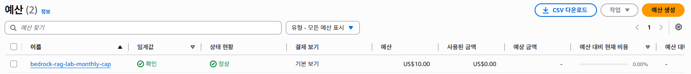

# 50. Cost & Cleanup

CI/CD(GitHub Actions + OIDC)는 이번 실습 범위에서 제외했다. `40-api`에서 CLI/HTTP API 검증까지 끝났으니, 원래 계획에서 CI/CD가 있던 자리를 비용 관리로 채운다.

## 완료 기준

```text
비용 구조 분석
        ↓
AWS Budgets로 월 $10 상한 설정 (Terraform)
        ↓
알림 임계값 확인 (50% / 80% / 100% / 예측치 100%)
        ↓
실습 종료 후 terraform destroy로 리소스 정리
```

## 1. 비용 분석 (2026-08-24 기준)

실제 사용 패턴 기준으로 계산하면, 이 실습에서 실제로 나갈 비용은 **거의 0에 수렴**한다. 아래 예산은 "실제 지출 예상"이 아니라 **오작동(무한루프 등)으로 비용이 튀는 상황을 잡는 트립와이어**로 잡는 것이다.

| 항목 | 단가 | 이 실습 사용량 | 실질 비용 |
| --- | --- | --- | --- |
| Titan Embed V2 (embedding) | $0.02 / 백만 토큰 | 문서 3개, 수백 토큰 | 사실상 $0 |
| Nova Micro (생성) | 입력 $0.035 / 백만 토큰 | curl 테스트 10~20회 | 사실상 $0 (센트 미만) |
| S3 Vectors 저장 | $0.06 / GB / 월 | 벡터 몇 개 (KB 단위) | 사실상 $0 |
| S3 Vectors 쿼리 | TB당 과금 | 테스트 조회 수십 회 | 사실상 $0 |
| S3 표준 저장 | ~$0.025 / GB / 월 | 문서 3개 (KB 단위) | 사실상 $0 |
| Lambda | 프리티어 100만 요청/월 | 테스트 수십 회 | $0 (프리티어 내) |
| API Gateway HTTP API | $1.00 / 백만 요청 | 테스트 수십 회 | 사실상 $0 |

> 단가는 US 리전 기준 검색 결과이며, `ap-northeast-2` 단가는 비슷하거나 소폭 높을 수 있다 — 정확한 리전별 단가는 [AWS Bedrock Pricing](https://aws.amazon.com/bedrock/pricing/), [AWS S3 Pricing](https://aws.amazon.com/s3/pricing/)에서 재확인한다.

**설계 단계에서 이미 상시 과금 함정을 피했다.**

- OpenSearch Serverless 대신 **S3 Vectors** → OCU(시간당 과금) 없음
- EC2/ECS 대신 **Lambda** → 유휴 시 과금 없음
- REST API 대신 **HTTP API** → 더 저렴하고 유휴 과금 없음

즉 지금 상태로 며칠 방치해도 실질 비용은 거의 늘지 않는다. 진짜 위험은 "얼마나 쓰느냐"가 아니라 "무한루프나 오작동으로 갑자기 많이 호출되는 상황"이다. Bedrock은 토큰 기반이라 다른 서비스보다 이런 상황에서 더 빨리 늘어날 수 있다.

## 2. 계정 전체가 아니라 이 프로젝트만 — 태그로 범위 좁히기

이 AWS 계정에는 다른 프로젝트도 있어서, 예산을 계정 전체로 잡으면 다른 프로젝트 비용까지 섞여 알람이 뜬다. `Project = bedrock-rag-lab` 태그로 좁히기로 했는데, 여기서 중요한 함정을 하나 발견했다.

**Bedrock의 on-demand 모델 호출(임베딩/생성) 비용은 일반 리소스 태그로 안 잡힌다.** S3 버킷, Lambda, API Gateway, IAM Role은 이미 `Project` 태그가 붙어있어서 태그 필터로 잡히지만, 정작 이 프로젝트의 "AI 비용"이자 오작동 시 가장 빨리 튈 수 있는 항목(Bedrock 모델 호출)은 리소스에 직접 태그를 붙일 수 없다 (Application Inference Profile을 따로 만들어야 태그가 붙는데, 지금은 AWS가 만든 system-defined inference profile을 쓰는 중이라 해당 없음).

대신 2026년 4월에 추가된 기능을 쓴다 — **IAM 사용자/Role에 태그를 붙이고 비용 할당 태그로 활성화하면, 그 주체가 호출한 Bedrock 비용도 같은 태그로 잡힌다.** 그래서 두 가지를 같이 한다.

1. 리소스 태그: `infra/*.tf`에서 만드는 리소스들(S3, Lambda, IAM Role, KB 등)에 이미 `Project = "bedrock-rag-lab"`이 붙어있다.
2. IAM 주체 태그: `bedrock-rag-lab` User 자신에도 같은 태그를 붙였다 (User는 Terraform 관리 대상이 아니라 Admin이 직접 태깅).

```bash
aws iam tag-user --user-name bedrock-rag-lab --tags Key=Project,Value=bedrock-rag-lab --profile default
```

두 가지 다 같은 태그 키(`Project`)를 하나만 비용 할당 태그로 활성화하면 같이 적용된다.

> 활성화 후 실제 비용 데이터에 태그가 반영되기까지 최대 24시간 걸릴 수 있다 (AWS 공식 안내). 태그는 소급 적용되지 않는다 — 활성화 이후 발생한 비용만 잡힌다.

## 3. AWS Budgets로 $10 상한 설정, 태그로 필터링 (`infra/budget.tf`)

```hcl
resource "aws_ce_cost_allocation_tag" "project" {
  tag_key = "Project"
  status  = "Active"
}

resource "aws_budgets_budget" "monthly_cap" {
  name         = "bedrock-rag-lab-monthly-cap"
  budget_type  = "COST"
  limit_amount = "10"
  limit_unit   = "USD"
  time_unit    = "MONTHLY"

  cost_filter {
    name   = "TagKeyValue"
    values = ["Project$bedrock-rag-lab"]
  }

  depends_on = [aws_ce_cost_allocation_tag.project]

  notification {
    comparison_operator        = "GREATER_THAN"
    threshold                  = 50
    threshold_type             = "PERCENTAGE"
    notification_type          = "ACTUAL"
    subscriber_email_addresses = [var.budget_alert_email]
  }
  # 80%, 100% ACTUAL, 100% FORECASTED 동일 패턴으로 3개 더
}
```

임계값을 4단계로 나눈 이유:

- **50% / 80% ACTUAL** — 조기 경보. 이 실습 성격상 실제로 여기까지 갈 일은 거의 없어서, 도달하면 그 자체로 이상 신호다.
- **100% ACTUAL** — 상한 도달. 즉시 원인 확인.
- **100% FORECASTED** — 현재 추세대로면 이번 달 상한을 넘을 것으로 예측되는 시점의 알림. ACTUAL 100%보다 먼저 올 수 있어 더 빠른 대응이 가능하다.

## 4. 이메일 설정 (커밋하지 않음)

`var.budget_alert_email`은 기본값이 없다 — 실제 이메일 주소를 Git에 남기지 않기 위해서다. `infra/terraform.tfvars.example`을 복사해서 `infra/terraform.tfvars`(이미 `.gitignore`의 `*.tfvars`에 걸림)에 실제 값을 넣는다.

```bash
cp infra/terraform.tfvars.example infra/terraform.tfvars
# terraform.tfvars 안의 budget_alert_email을 실제 이메일로 수정
```

## 5. 실행 주체(bedrock-rag-lab User) 권한 확장

AWS Budgets, Cost Explorer 둘 다 리전이 없는 글로벌 서비스라 `Resource`에 리전/계정을 넣지 않는다.

```json
{
  "Sid": "BudgetsManage",
  "Effect": "Allow",
  "Action": ["budgets:ViewBudget", "budgets:ModifyBudget", "budgets:ListTagsForResource"],
  "Resource": "*"
},
{
  "Sid": "CostAllocationTagManage",
  "Effect": "Allow",
  "Action": ["ce:ListCostAllocationTags", "ce:UpdateCostAllocationTagsStatus"],
  "Resource": "*"
}
```

`budgets:ListTagsForResource`는 처음엔 빠뜨렸다 — `terraform plan`이 생성된 Budget의 태그를 읽어오려다 막혀서 뒤늦게 추가했다.

적용 방법은 [iam/README.md](../../iam/README.md) 참고.

## 6. Terraform 적용

```powershell
cd infra
terraform fmt
terraform validate
terraform plan
terraform apply
```

> **정정**: 처음엔 "적용 후 구독 확인 메일이 온다"고 안내했는데 틀렸다. `subscriber_email_addresses`로 등록하는 방식은 SNS 구독이 아니라 AWS Budgets 자체 이메일 발송이라 **확인 절차가 없다.** 등록된 이메일이 맞는지는 CLI로 바로 확인 가능하고, 실제 메일은 임계값을 넘었을 때만 온다 (그게 목적이므로 평소엔 안 오는 게 정상이다).

```bash
aws budgets describe-subscribers-for-notification \
  --account-id <ACCOUNT_ID> --budget-name bedrock-rag-lab-monthly-cap \
  --notification NotificationType=ACTUAL,ComparisonOperator=GREATER_THAN,Threshold=50.0 \
  --profile bedrock-rag-lab
```

확인:

```bash
aws budgets describe-budget --account-id <ACCOUNT_ID> --budget-name bedrock-rag-lab-monthly-cap --profile bedrock-rag-lab
```

콘솔에서도 확인했다 — `bedrock-rag-lab-monthly-cap`, 예산 $10.00, 사용된 금액 $0.00 (0.00%), 상태 정상.



## 7. 실습 종료 후 리소스 정리

모든 검증이 끝나면 과금 리소스를 정리한다. 순서는 의존성 역순(Knowledge Base/Data Source → S3 Vectors → Lambda/API Gateway → IAM Role → S3 Bucket)을 Terraform이 알아서 계산한다.

```bash
cd infra
terraform destroy
```

Budget 자체는 과금 리소스가 아니므로(무료), 다음 실습을 위해 남겨두거나 `terraform destroy`에 포함해 함께 지워도 된다 — 이번엔 다른 리소스와 함께 지웠다.

destroy 후 확인. `lambda:ListFunctions`, `iam:ListRoles` 같은 계정 전체 List 계열 action은 애초에 `bedrock-rag-lab` User에 안 줬으므로(리소스별로 scoped action만 부여), 특정 리소스를 콕 집어 조회해서 "없음(NotFound)"이 나오는지로 확인한다.

```bash
aws lambda get-function --function-name bedrock-rag-lab-query --profile bedrock-rag-lab
aws iam get-role --role-name bedrock-rag-lab-kb-role --profile bedrock-rag-lab
aws iam get-role --role-name bedrock-rag-lab-lambda-query-role --profile bedrock-rag-lab
aws bedrock-agent list-knowledge-bases --profile bedrock-rag-lab
aws s3vectors list-vector-buckets --profile bedrock-rag-lab
aws apigatewayv2 get-apis --profile bedrock-rag-lab --query "Items[?Name=='bedrock-rag-lab-api']"
aws budgets describe-budgets --account-id <ACCOUNT_ID> --profile bedrock-rag-lab --query "Budgets[].BudgetName"
aws s3 ls --profile bedrock-rag-lab
```

`ResourceNotFoundException`/`NoSuchEntity`가 나오거나 빈 배열이면 정상이다. 전체 출력은 [destroy-verification.txt](destroy-verification.txt) 참고.

**부수적으로 확인된 것**: `aws s3 ls`에 `bedrock-rag-lab-*` 버킷은 안 남았지만, 이 실습과 무관한 다른 프로젝트 버킷 5개가 그대로 있었다 (이름은 비공개) — 이 계정에 정말 다른 프로젝트가 있다는 걸 재확인했고, 2번에서 예산을 계정 전체가 아니라 `Project` 태그로 좁힌 결정이 맞았다는 증거이기도 하다.

## 50-cost-cleanup 완료 (2026-08-24)

`terraform destroy`로 22개 리소스(Lambda, API Gateway, Knowledge Base, Data Source, S3 Vectors, S3 Bucket, IAM Role 2개, Budget, cost allocation tag)를 모두 정리했고, scoped 조회로 실제 삭제를 확인했다. `bedrock-rag-lab` IAM User와 관리형 정책(`AmazonS3FullAccess`, `bedrock-rag-lab-provisioning`)은 다음 실습에서 재사용하기 위해 의도적으로 남겨뒀다.

## 보안 체크

- `budget_alert_email`은 `terraform.tfvars`에만 두고 커밋하지 않는다. 실제 이메일이 코드/문서 어디에도 안 들어갔는지 커밋 전에 확인했다.
- 스크린샷에 이메일 주소가 보이면 가린다 (`00-aws-setup`에서 정한 Account ID 마스킹 원칙과 같다).
- Budgets/Cost Explorer 권한(`budgets:*`, `ce:*`)은 Resource `*`이지만, 두 서비스 다 계정 단위 리소스라 이 프로젝트 안에서는 범위를 더 좁힐 방법이 없다.

## 다음 단계

`terraform destroy`까지 확인되면 이 실습의 인프라 파트는 끝이다. 루트 `README.md`는 전체 실습이 마무리된 시점에 최종 정리한다.
